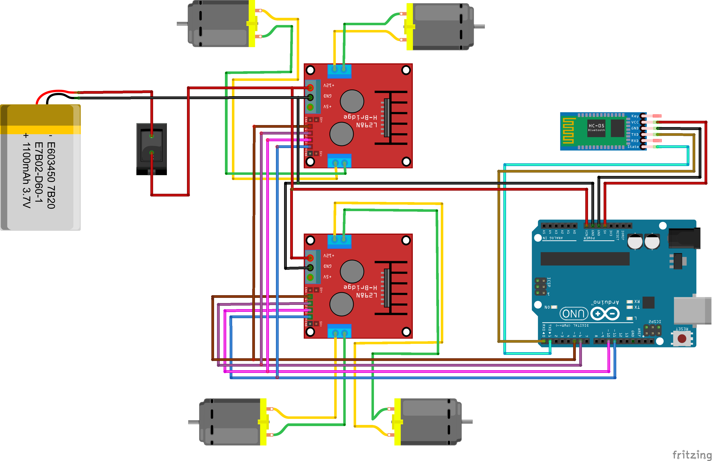

# Sumo RC competitive 
### Size
15 * 15 cm

### Weight
<=1kg

## Components
### Motors
 - 2x Both Sided Shaft BO Motor RPM-500.
 - 2x 12V High Torque Motor (Should Compatible with L298N motor driver module).
You can use any motor you want.
### Modules
- 1x L298N Motor Driver Module.
- 1x Arduino UNO.
- 1x HC-05 Bluetooth Module.
### Miscellaneous
-  Jumper wires (10x male to male, male to female, female to female).
-  Li-Po Battery 2100 MAH.
-  XT60 Li-Po Battery Connector.

See the Circuit Diagram Below:
# Circuit Diagram

